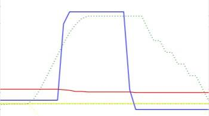

# MSI_2016-17_OnBoardCode
The repository for the code running over Onboard Microcontroller for Mars Rover Project, IIT-Bombay 2016-17

## Roboclaw Documentation

### Roboclaw Configurations 
One roboclaw is set to address 0x80, other at 0x81, both in packet serial modes.  

* [Roboclaw User Manual](http://downloads.ionmc.com/docs/roboclaw_user_manual.pdf)
* [Roboclaw Datasheet](http://downloads.ionmc.com/docs/roboclaw_datasheet_2x45A.pdf)

### USB settings for roboclaw

Roboclaw1 is the "RightClaw" and should be connected to port 3 of USB hub  
Roboclaw2 is the "LeftClaw" and should be connected to port 4 of USB hub  
The config files can be found in /etc/udev/rules.d/72-micro-devel.rules  
Checking whether the appropriate roboclaw is connected, run this command :  
   `udevadm info -a -n /dev/roboclaw1 | grep 'KERNEL'` to know the tty number  
   `ls -lF /dev | grep roboclaw*`   
   
Checking whether it's roboclaw on ttyACM1, run this command :  
   `udevadm info -a -n /dev/ttyACM0 | grep '{product}'` 
 

## General Installation and Debugging Tips

### Configuring RPI for the rover

* **Getting Rpi SSH ready** : Install Raspbian and place empty file named "ssh" (no extensions) in boot directory for sshing to pi.
*  [**Installing ROS Indigo on RPi** ](http://wncc-iitb.org/wiki/index.php/ROS#Installation_of_ROS_Indigo_on_RPi)

### USB Locking 
* Make a .rules file in `/etc/udev/rules.d` starting with numbers above 50 (eg 72-\<filename\>.rules)
* Describe parameters to check for while creating a new symbolic link to already existing rules like ttyACM/USB
* An example for rules file [(made for roboclaw)](https://github.com/Agrim9/MSI_2016-17_OnBoardCode/blob/master/72-micro-devel.rules)
* Change devpath/product etc to get your device running. Don't forget to `sudo udev restart` after publishing new rules for a device
* `udevadm info --name=\<symlink_name\>` to check whether rule worked or not

### Debugging 

* **Roscore doesn't work** *(1 GB log file error)*: Force use roscore with appropriate ROS_IP and ROS_MASTER_URI. No cleanup/etc is required for same, the error is due to some internal SSH kindof error with ROS.
* **ROSlaunch Error** *Can't locate launch node of type<>* : make python file executable by chmod +x filename.py and putting `#!/usr/bin/env python` in the start of python file
* **ValueError** : *The channel sent is invalid on a Raspberry Pi* : Change board mode from GPIO.board to GPIO.BCM
* **Drive Jerks** : GPIO.cleanup() **MUST** be always done for drive w/o jerks
* **catkin_make not working** *package.xml doesn't exist in file dir* : Reinstall ros-indigo-catkin to solve the problem

## APM node
run : `rosrun mavros mavros_node _fcu_url:=/dev/ttyACM0:115200`  
Subscriber node : `/mavros/global_position/raw/fix`  
Mavros package for extracting data from Ardu pilot MEGA (GPS module Ublox Neo 7m with compass)  

## Plotting Real Time data on control system using ROS

Plotting done using matplotlib. Used threads to get it done in real time. One important thing to note was that **matplotlib** functions always need to be used in main thread only. Not following this causes [Main thread is not in main loop](http://stackoverflow.com/questions/16016102/matplotlib-and-multiprocessing-runtimeerror) error. For bypassing this issue, run the PID control loop concurrently in different forked threads, and have the plotting code in main thread.  

 

